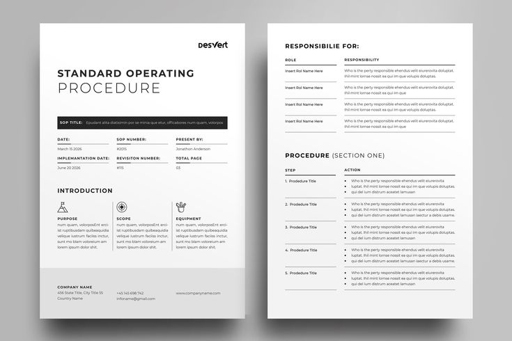

* *"Do I really need an SOP for this?"*
* *"Why do my teammates ignore the SOPs I already wrote?"*
* *"Why do people still ask me questions that the SOP already answers?"*

These are the questions most teams quietly ask themselves.
And they are the same questions that pushed me to change how I create SOPs.

I create SOPs differently. I create SOP documents that teams actually open, use, reference, and improve.
This article will break down my exact process, the structure I use, and the mistakes I avoid each time.

## What Are SOPs?

The term SOP means Standard Operating Procedure. SOPs describe how a team completes a task from start to finish.

[*source*](https://creativemarket.com/Niofix/288466628-Standard-Operating-Procedure-SOP)

A useful SOP document should do these three things:
1. It should reduce confusion. The document should show the exact steps someone must take to get the expected result.

2. It should protect doc quality. Everyone should follow the same repeatable process, so the output can stay consistent.

3. It should improve your team's accountability. The SOP should make responsibilities clear. Everyone should  know who owns the doc and who follows it.

A good SOP is simple, direct, and easy to navigate. A bad SOP is long, vague, and it can easily get abandoned. That is why I try to create SOPs that stay active inside the team, not in a forgotten folder.

## Step 1: Start With a Clear, Searchable Title

I always give each SOP a title that tells the team exactly what the document does. The title must explain the action and the context. If someone can’t find the SOP through search, they won’t use it.

**Bad title example**:

"Customer Feedback Flow"

**Good title example:**

"How to Process and Close Customer Feedback Tasks"

A good title saves everyone time. People should be able to find your SOP fast and start using it.

## Step 2: Assign a Clear SOP Doc Owner

Every SOP doc needs at least one owner. If nobody owns it, the document dies. It becomes outdated, confusing, and useless.

Before I start the document I always assign the following roles clearly:

1. **The SOP doc Owner** (the person responsible for updates). You can be the owner sometimes.

2. **The Subject Matter Expert(SME)** i.e. the person who knows how the process actually works.

I ask the SME specific questions about the process like :

* “What triggers the process?”
* “Where does the process stop?"
* “What mistakes slow people down?”
* “What exact outcomes should this produce?”

I collect this information and more before I write anything. This way, I won't have to rewrite the entire SOP doc later because I missed important details.

## Step 3: Map the Start, Stop, and the Key Steps

Before I write a single line, I try to understand these things:

* Where the process starts
* Where it ends
* The mini-results in between

This helps me keep the SOP short and clean. Most teams overload SOPs by writing every detail at once. I do the opposite. I break the workflow into small, clear steps that create small outcomes.

## Step 4: Fill in the Purpose, Inputs, and Outputs

This is how I structure my SOPs everytime. I tailor the sections to these three components;

1. **Purpose**
* I explain why this SOP exists.
* I show what happens when the team follows it, and what happens when they don’t.

2. **Inputs**
* I list the tools, access, and materials needed to complete the process.

3. **Outputs**
* I describe what a successful completion looks like. This gives the team a clear finish line.

## Step 5: Write the Procedure Using Small, Clear Steps

This is usually my process when I write SOPs;

* Each step must produce a mini-result. This rule keeps the SOP readable.
* I try to avoid complex paragraphs.
* I avoid passive voice.
* I avoid over-explaining.
* I use simple steps and break the complicated ones down into steps with mini-results
 
I usually keep the procedure to 8–10 small steps. I believe this is enough to explain the process, but not enough to overwhelm anyone.

## Step 6: Add FAQs
I add FAQs only when they help the reader with common mistakes and inquiries. This way, team members don't have to ask the SME the same questions over and over again. The SOP document can easily answer those questions.

Good FAQ topics include:

* common mistakes
* account access issues
* edge cases
* frequent inquiries during onboarding
* exceptions the team must understand

## Step 7: Publish, Use, and Improve

SOPs are not static, they evolve. Once I publish an SOP doc, I make sure to do these 3 things to maintain it's quality and importance;

1. Give edit access to the Owner and SMEs
2. Set up a versioning system(I use git) to track changes
3. Update the doc whenever the workflow shifts.

This way, your SOP doc is accurate, trusted, and your team can actively use it.

## Why do Companies not Use Their SOP Docs?

Teams usually ignore SOP docs because the docs make their work harder, not easier. I noticed that when writers add too much detail to simple tasks, they tend to overload the page or make a simple workflow way too complicated. 
here are some simple rules for you to follow when drafting SOP documents. 

| **Do** | **Don’t** |
|--------|-----------|
| Create SOPs only for repeatable processes that truly need clear guidance. | Create SOPs for tasks that are one-off, too simple, or do not require formal documentation. |
| Keep the SOP short, clear, and broken into small steps that achieve one mini-result at a time. | Make the SOP too big, bloated, or structured like a full textbook. |
| Add details only when those details directly improve clarity or change the final outcome. | Add unnecessary details like excessive screenshots, long explanations, or step-by-step visuals that do not move the process forward. |
| Focus on clarity and speed so teams can scan the SOP and take action immediately. | Slow the team down with over-documentation, noise, and distracting information. |
| Use explicit headings and a simple structure that helps teams follow the workflow easily. | Hide key steps inside long paragraphs that make the SOP hard to follow. |
| Write with the user in mind, make the SOP practical, actionable, and predictable. | Write for complexity, trying to make the SOP look “complete” instead of useful. |

## My Free SOP Template

I use the same structure every time.
It keeps my documents consistent and easy to follow.

You can access the free template here:
[Access the SOP Template](https://docs.google.com/document/d/1ihev3oxLiv_JOUZLxZJrncY7nWOnpxRzLwitvKhy76w/edit?usp=sharing)

